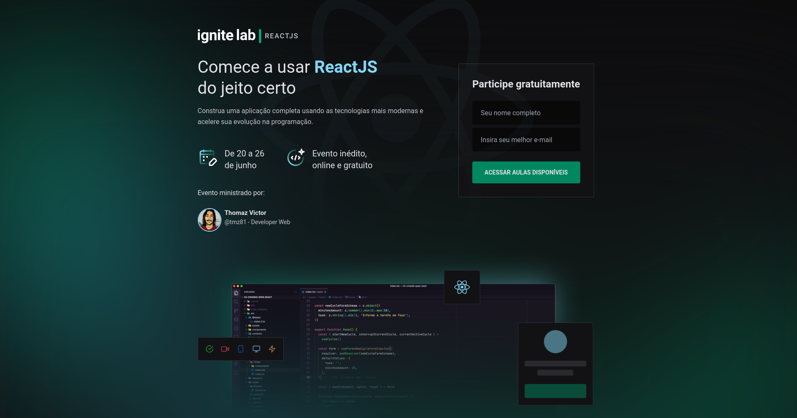

<h1 align="center">Ignite Lab - ReactJS</h1>

<div align="center">
  
</div>


<p align="center">
  <a href="#-tecnologias">Tecnologias</a>&nbsp;&nbsp;&nbsp;|&nbsp;&nbsp;&nbsp;
  <a href="#-projeto">Projeto</a>&nbsp;&nbsp;&nbsp;|&nbsp;&nbsp;&nbsp;
  <a href="#-layout">Layout</a>
</p>

<br>

## 💻 Tecnologias

- [Vite](https://vitejs.dev/)
- [React](https://pt-br.reactjs.org/)
- [TypeScript](https://www.typescriptlang.org/)
- [Tailwind](https://tailwindcss.com/)
- [GraphQL](https://graphql.org/)
- [GraphCMS](https://graphcms.com/)
- [GraphQL Generate Code](https://www.graphql-code-generator.com/)
- [Apollo Client](https://www.apollographql.com/)
- [Phosphor Icons](https://phosphoricons.com/)
- [Vime](https://vimejs.com/)

## 📝 Projeto

Foi desenvolvido durante a semana do IgniteLab pela <a href="https://rocketseat.com.br/"> Rocketseat</a>. Neste evento aprendemos como usar as tecnologias mais atuais e poderosas na construção de sistemas simples ou avançados.

## 🖌️ Layout

Você pode visualizar o layout do projeto através [desse link](https://www.figma.com/community/file/1120711251998877938). Lembrando que você precisa ter uma conta no [Figma](http://figma.com/) para acessá-lo.

## 🏃 Rodando a aplicação

```bash
# Clone este projeto
$ git clone https://github.com/tmz81/IgniteLab.git

# Acesse
$ cd event-platform

# Instale as dependências
$ npm

# Execute o projeto
$ npm run dev

# O projeto será inicializado em http://localhost:3000
```

## 📡 Configurações adicionais ao projeto

Para executar o projeto você precisa configurar o GraphCMS e adicionar os itens, para que consiga inserir dados na aplicação.

Abaixo, tem o schema que você pode clonar e usar como base para o projeto:

- [Link Schema Clone](https://app.graphcms.com/clone/95c308ff849e40229ecce728ac6c0de4?name=New)

No esquema você pode adicionar os itens para listá-los

[x] Challenge   
[x] Lesson   
[x] Subscriber  
[x] Teacher